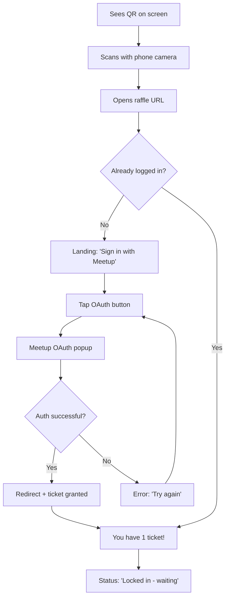
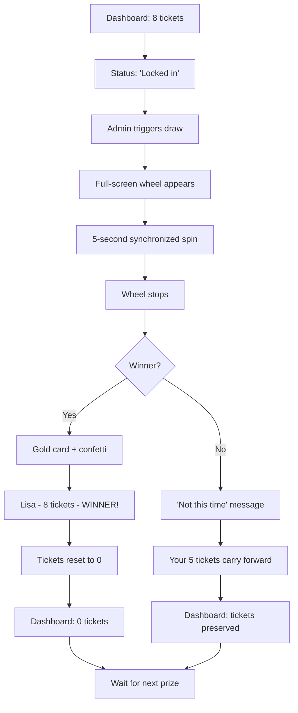
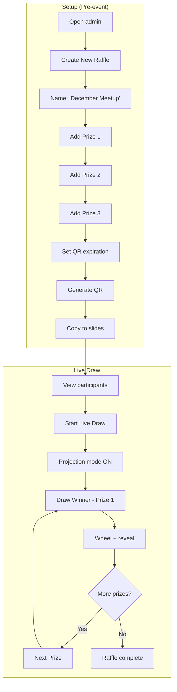

# UX Design Specification servus-raffle

**Author:** Ben
**Date:** 2025-12-25

---

## Executive Summary

### Project Vision

Servus Raffle transforms meetup swag giveaways from awkward logistics into memorable community moments. By combining a loyalty-based ticket system with synchronized real-time animations, the platform rewards dedicated attendees while creating shared excitement during the raffle draw.

The core philosophy: **fairness through persistence**. First-timers have a chance, but regulars who keep showing up will eventually win - and everyone in the room will see their loyalty pay off.

### Target Users

**Participants (Mobile Experience):**
- First-time attendees discovering the raffle via QR scan
- Regular attendees tracking their accumulated tickets
- All watching the synchronized wheel spin on their phones

**Organizers (Admin/Projection Experience):**
- Setting up raffles and generating QR codes before events
- Running live drawings projected on the big screen
- Managing prizes and viewing participant statistics

### Key Design Challenges

1. **Dual-context UI**: Mobile-first participant experience + projection-optimized admin display
2. **Zero-friction onboarding**: QR scan to participation in under 30 seconds in a crowded room
3. **Synchronized spectacle**: Wheel animation must feel perfectly synced across 50+ devices
4. **Transparent fairness**: The ticket accumulation/reset system must be immediately understood

### Design Opportunities

1. **Anticipation mechanics**: Prominent ticket counts with contextual messaging to build excitement
2. **Community celebration**: Winner displays that validate the loyalty system publicly
3. **Projection-first spectacle**: Admin UI designed for maximum visual impact on big screens

## Core User Experience

### Defining Experience

Servus Raffle has two distinct core experiences that must both succeed:

**Utility Core: Frictionless Participation**
The QR scan → OAuth → ticket confirmation flow must complete in under 30 seconds. This is the gateway - if it fails, nothing else matters. Users scan, tap once for Meetup.com OAuth, and immediately see "You have X tickets."

**Emotional Core: Synchronized Spectacle**
The wheel spin → winner reveal is why the product exists. This 5-second animation, synchronized across 50+ devices, creates the shared community moment that makes the raffle memorable. Everyone watches together - on their phones and on the big screen.

The utility core enables participation. The emotional core delivers value.

### Platform Strategy

| Context | Platform | Interaction | Priority |
|---------|----------|-------------|----------|
| Participants | Mobile web (iOS Safari, Android Chrome) | Touch | Primary |
| Admin setup | Desktop web | Mouse/keyboard | Secondary |
| Live drawing | Desktop web → projector | View-only (audience) | Critical |

**Key Platform Decisions:**
- Web-only (no native apps) - attendees access via QR code URL
- Mobile-first responsive design with desktop admin optimization
- Projection mode for admin UI during live drawings
- No offline support required (event venue has WiFi)

### Effortless Interactions

**Must be zero-friction:**
1. **QR scan to participation** - Native camera opens link, OAuth is one tap, ticket confirmed instantly
2. **Understanding your odds** - Ticket count prominently displayed with context ("Your best odds yet!")
3. **Watching the draw** - Real-time sync with no manual refresh, no "is it working?" doubt

**Automatic behaviors:**
- Ticket grant on valid QR scan (no "claim" button)
- Ticket reset after win (no confirmation needed)
- Real-time participant count updates for admin

### Critical Success Moments

| Moment | User | Success State | Failure State |
|--------|------|---------------|---------------|
| First scan | Felix | "You have 1 ticket" in <30 sec | Stuck on OAuth, confused, abandons |
| Pre-raffle | Lisa | Sees 8 tickets, feels anticipation | "Am I registered?" uncertainty |
| Wheel spin | Everyone | Synchronized suspense, eyes on screens | Laggy, desync'd, anticlimactic |
| Winner reveal | Lisa | Joy + public validation of loyalty | Awkward "who won?", no celebration |
| Post-win | Lisa | Clear reset message, positive framing | Confusion about lost tickets |

### Experience Principles

1. **Instant Gratification** - Every user action produces immediate, visible feedback. No loading spinners, no "please wait," no ambiguity about what happened.

2. **Shared Spectacle** - The raffle is a community event, not a private transaction. Design for the room, not just the individual screen. Everyone experiences the same moment together.

3. **Transparent Fairness** - Users always understand their odds and how the system works. Ticket counts are visible, the loyalty mechanic is explained, winners' ticket counts are displayed publicly.

4. **Zero Cognitive Load** - Participants make no decisions. Scan, authenticate, watch. No settings, no preferences (MVP), no choices. The system handles everything.

## Desired Emotional Response

### Primary Emotional Goals

**For Participants:**
- **Anticipation** - Building excitement as ticket count grows and the draw approaches
- **Collective excitement** - Shared suspense during the synchronized wheel spin
- **Validation** - Winners feel their loyalty was recognized; non-winners feel the system is fair

**For Organizers:**
- **Confidence** - Complete control over the raffle with zero logistical stress
- **Pride** - Running a polished, engaging community moment

**The "tell a friend" moment:** The synchronized wheel spin where everyone watches together, culminating in a winner reveal that shows their ticket count - validating the loyalty system publicly.

### Emotional Journey Mapping

| Stage | Desired Feeling | Failure State |
|-------|-----------------|---------------|
| Discovery (QR scan) | Curious, welcomed | Confused, excluded |
| Registration | Effortless, included | Frustrated, abandoned |
| Waiting | Anticipation, hope | Uncertain, disengaged |
| Wheel spin | Collective excitement | Bored, distracted |
| Winner reveal | Joy (winner), hope (others) | Disappointment, resentment |
| Post-raffle | Satisfied, looking forward | Forgotten, indifferent |
| Returning | Rewarded loyalty | Starting over feeling |

### Micro-Emotions

**Critical emotional states to cultivate:**

| Positive Target | Negative to Avoid | Design Response |
|-----------------|-------------------|-----------------|
| Confidence | Confusion | Immediate feedback, clear states |
| Trust | Skepticism | Transparent ticket counts, public winner display |
| Excitement | Anxiety | Fun animations, low-stakes framing |
| Belonging | Isolation | Synchronized experience, community focus |
| Hope | Resignation | Ticket accumulation messaging, fairness visibility |

### Design Implications

**Emotion → Design mapping:**

1. **Confidence** → Every action produces immediate visual confirmation. "You're in!" states are unmistakable. No ambiguous loading states.

2. **Anticipation** → Ticket count is the hero element on participant screens. Contextual copy builds excitement: "5 tickets - your best odds yet!"

3. **Collective Excitement** → The wheel animation is synchronized to <500ms across all devices. Everyone experiences the same 5 seconds of suspense together.

4. **Validation** → Winner display prominently shows ticket count alongside name. "Lisa - 8 tickets - WINNER!" proves the system rewards loyalty.

5. **Hope** → Non-winners see positive messaging: "Not this time - but your 3 tickets carry forward!" Emphasize accumulation, not loss.

### Emotional Design Principles

1. **Celebrate publicly** - Winning is a community moment, not a private notification. Design for the room.

2. **Make fairness visible** - Show ticket counts, display winner's accumulated tickets, explain the system. Trust comes from transparency.

3. **Remove all doubt** - Every state should be unambiguous. Users should never wonder "did it work?" or "am I in?"

4. **Frame losses as progress** - Non-winners aren't losers; they're building toward their moment. Messaging should reinforce ticket accumulation.

5. **Keep it light** - This is swag at a meetup, not a lottery. The tone should be fun, playful, and low-stakes even while the experience feels exciting.

## UX Pattern Analysis & Inspiration

### Inspiring Products Analysis

**Kahoot (Live Quiz Platform)**
- Instant join via code - no account friction
- Projection-optimized bold UI readable from back of room
- Real-time synchronization across all participants
- Participants have minimal UI - just respond to prompts
- **Key learning:** Design for the room, not just the screen

**Duolingo (Gamification & Celebration)**
- Streak counters that build anticipation over time
- Celebration animations that create emotional payoff
- Progress-positive framing ("You're almost there!" vs "You failed")
- Micro-feedback on every interaction
- **Key learning:** Make accumulation visible and exciting

**Slido (Event Interaction)**
- QR code → immediate participation
- Presenter controls what audience sees
- Real-time vote/count animations
- **Key learning:** Admin drives the experience, participants watch

**Wheel of Fortune (The Core Mechanic)**
- Gradual deceleration builds anticipation
- Clear, unmistakable reveal moment
- Everyone watches the same wheel together
- **Key learning:** The spin is the experience - don't rush it

### Transferable UX Patterns

**Flow Patterns:**
- QR scan → OAuth → confirmation in single flow (Kahoot/Slido)
- Single-screen participant experience with one clear status (Kahoot)
- Presenter-controlled sequential progression (Slido)

**Interaction Patterns:**
- One-tap participation after initial auth (Kahoot)
- Real-time count animations for engagement (Slido)
- 5-second gradual deceleration for anticipation (Wheel of Fortune)

**Visual Patterns:**
- Projection-friendly: bold colors, huge text, minimal elements (Kahoot)
- Accumulation as hero element with contextual copy (Duolingo)
- Celebration explosions on success moments (Duolingo)

### Anti-Patterns to Avoid

| Avoid | Because | Instead |
|-------|---------|---------|
| Account creation forms | Kills event participation | OAuth only |
| Ambiguous loading states | Creates real-time anxiety | Skeleton UI, optimistic updates |
| Desynchronized reveals | Ruins shared moment | WebSocket sync <500ms |
| Small text/touch targets | Unusable at events | Mobile-first, large elements |
| Multi-step flows | People abandon | One action per screen |
| Winner without context | Misses loyalty validation | Show ticket count with name |

### Design Inspiration Strategy

**Adopt:** QR instant-join flow, projection-friendly admin UI, celebration animations, gradual wheel deceleration

**Adapt:** Kahoot leaderboards → simple ticket count display; Duolingo streaks → accumulated tickets with messaging; Slido presenter → admin dashboard with draw controls

**Avoid:** Sound-heavy design (meetup context), complex gamification, any multi-step participant flows

## Design System Foundation

### Design System Choice

**Primary:** shadcn/ui + Tailwind CSS

A modern, flexible design system built on Radix UI primitives with Tailwind CSS styling. Components are copied into the project (not npm dependencies), giving full ownership and customization control.

**Supporting Tools:**
- **Tailwind CSS** - Utility-first styling for rapid iteration
- **Radix UI** - Accessible primitives underlying shadcn components
- **Framer Motion** - Animation library for wheel spin and celebrations
- **CSS Variables** - Design tokens for theming and projection mode

### Rationale for Selection

| Requirement | How shadcn/ui Delivers |
|-------------|----------------------|
| Projection-friendly UI | Full control over sizing, contrast, colors via Tailwind |
| Wheel animation | Tailwind + Framer Motion = complete animation control |
| MVP speed | Pre-built buttons, cards, dialogs - copy and customize |
| Mobile-first | Tailwind's responsive utilities built-in |
| Real-time states | Easy to style loading, success, error states |
| Developer ownership | Components in your codebase, no version lock-in |
| Next.js compatibility | Built for App Router and Server Components |

**Why not alternatives:**
- MUI: Too heavy, Material aesthetic doesn't fit community/fun vibe
- Chakra: Less momentum, fewer examples in Next.js App Router
- Pure Tailwind: Would require building too many components from scratch

### Implementation Approach

**Setup:**
1. Initialize Tailwind CSS with Next.js
2. Run `npx shadcn-ui@latest init` to configure
3. Add components as needed: `npx shadcn-ui@latest add button card dialog`

**Component Strategy:**

| Component | Source | Customization |
|-----------|--------|---------------|
| Buttons, Cards, Dialogs | shadcn/ui | Light theming |
| Wheel Animation | Custom | Framer Motion + CSS |
| Winner Celebration | Custom | Framer Motion + confetti library |
| QR Code Display | Custom + library | qrcode.react or similar |
| Real-time Status | Custom | Tailwind + state styling |

**File Structure:**
```
/components
  /ui          # shadcn/ui components (button, card, etc.)
  /raffle      # Custom raffle components (wheel, celebration)
  /admin       # Admin-specific components
  /participant # Participant-specific components
```

### Customization Strategy

**Design Tokens (CSS Variables):**
- `--primary`: Flutter Blue (#027DFD)
- `--secondary`: Warm accent for celebrations
- `--background`: Clean white/light gray
- `--foreground`: High contrast text

**Projection Mode Overrides:**
- `--text-size-projection`: 2x base
- `--contrast-projection`: Enhanced

**Projection Mode:**
- CSS class `.projection-mode` on body
- Doubles font sizes, increases contrast
- Simplifies UI to essential elements only
- Triggered when admin enters "Live Draw" mode

**Mobile Optimizations:**
- Touch targets minimum 44x44px
- Bottom-heavy UI for thumb reach
- Reduced motion option for accessibility

**Animation Tokens:**
- Wheel spin duration: 5000ms
- Wheel easing: cubic-bezier for gradual deceleration
- Celebration duration: 3000ms
- Micro-feedback: 150ms transitions

## Defining Experience

### The Core Interaction

**"Watch the wheel spin together and see who wins"**

This is the moment users will describe to friends. Not the QR scan, not the login - the story is: *"Everyone pulled out their phones, the wheel started spinning on all our screens at once, and when it stopped on Lisa's name showing 8 tickets, the whole room cheered."*

The wheel spin is the product. Everything else exists to make this moment possible.

### User Mental Model

**What users already understand:**
- Wheel of Fortune mechanics (spin, anticipation, reveal)
- QR codes for event check-in
- OAuth login flows (Meetup, Google, etc.)
- Raffles = random drawing with tickets

**What's new but intuitive:**
- Synchronized animation across all devices (like Kahoot)
- Visible ticket accumulation (transparent odds)
- Ticket count displayed with winner (loyalty validation)

**Key insight:** We're not teaching new interactions - we're combining familiar patterns in a novel way. Users will immediately understand how it works.

### Success Criteria

| Criteria | Target | Why It Matters |
|----------|--------|----------------|
| Synchronization | <500ms across all devices | Must feel like ONE shared moment |
| Spin duration | Exactly 5000ms | Long enough for suspense, short enough for attention |
| Winner clarity | Instant, unmistakable reveal | No "wait, who won?" confusion |
| Loyalty validation | Ticket count shown with name | Proves the system rewards persistence |
| Social moment | Eyes up from phones to cheer | Creates community, not isolation |

### Pattern Analysis

**Established patterns we're using:**
- Wheel of Fortune spin mechanics (universal understanding)
- Raffle winner announcements (familiar from physical events)
- Real-time synchronized experiences (proven by Kahoot, Slido)

**Novel combination:**
- Wheel spin + device sync + transparent ticket display
- The innovation isn't any single element - it's how they combine

**No user education needed:** Every element is familiar; only the combination is new.

### Experience Mechanics

**The Wheel Spin Sequence:**

| Phase | Action | Timing |
|-------|--------|--------|
| Trigger | Admin clicks "Draw Winner" | T+0ms |
| Broadcast | All devices receive DRAW_STARTING | T+0ms |
| Transition | Screens switch to wheel view | T+100-200ms |
| Fast spin | Wheel rotates, names flash past | T+300-3000ms |
| Deceleration | "Will it stop here?" moments | T+3000-5000ms |
| Stop | Wheel lands on winner segment | T+5000ms |
| Pause | Brief suspense moment | T+5000-5500ms |
| Reveal | Winner celebration begins | T+5500ms |
| Celebration | Confetti, name, ticket count | T+5500-8500ms |

**Winner Display:** "Lisa - 8 tickets - WINNER!"
**Non-winner Display:** "Not this time - your 3 tickets carry forward!"

**Technical Requirements:**
- Server broadcasts random seed to all clients
- Identical seed = identical animation on all devices
- WebSocket latency <500ms for sync
- CSS/Framer Motion animation, not server-rendered frames

**Interaction States:**

| State | Participant Screen | Admin Screen |
|-------|-------------------|--------------|
| Idle | Ticket count + "Waiting for draw" | "Draw Winner" button |
| Spinning | Full-screen wheel animation | Same wheel (projection) |
| Revealing | Winner celebration or "carry forward" | Winner details + "Next Prize" |

**Error Handling:**
- Connection lost during spin → Reconnect shows current state
- Spin desync → Client requests resync from server
- Admin closes browser → Spin completes, results persist

## Visual Design Foundation

### Color System

**Brand Source:** Flutter Munich meetup branding, derived from official Flutter brand guidelines.

**Light Mode Palette:**

| Role | Color | Hex | Usage |
|------|-------|-----|-------|
| Primary | Flutter Blue | #027DFD | Buttons, links, interactive elements |
| Primary Dark | Navy | #1E3A5F | Headers, emphasis, text |
| Background | Sky Tint | #F5FAFB | Page background |
| Surface | White | #FFFFFF | Cards, elevated elements |
| Celebration | Gold | #F7DC6F | Winner highlights, confetti |
| Warm Accent | Coral | #E8A598 | Friendly touches, secondary accents |
| Success | Green | #22C55E | Confirmations, "You're in!" |
| Error | Red | #EF4444 | Error states |
| Text | Navy | #1E3A5F | Primary text |
| Text Muted | Gray | #6B7280 | Secondary text, captions |

**Dark Mode Palette (User Preference):**

| Role | Color | Hex |
|------|-------|-----|
| Primary | Sky Blue | #54C5F8 |
| Background | Deep Navy | #0F172A |
| Surface | Slate | #1E293B |
| Celebration | Bright Gold | #FBBF24 |
| Text | Near White | #F8FAFC |
| Text Muted | Slate Gray | #94A3B8 |

**Projection Mode (Always Dark, Maximum Contrast):**

| Role | Color | Hex |
|------|-------|-----|
| Background | Pure Black | #000000 |
| Primary | Bright Blue | #54C5F8 |
| Celebration | Saturated Gold | #FFD700 |
| Text | Pure White | #FFFFFF |
| Winner Highlight | Gold on Black | #FFD700 |

**Mode Switching:**
- Light/Dark: Respects `prefers-color-scheme` media query
- Projection: Activated when admin enters "Live Draw" mode
- Projection always overrides to dark for maximum visibility on projectors

### Typography System

**Primary Font:** Inter

| Element | Weight | Size (Mobile) | Size (Projection) | Line Height |
|---------|--------|---------------|-------------------|-------------|
| Hero Number (Ticket Count) | Bold (700) | 72px | 144px | 1.0 |
| Winner Name | Bold (700) | 48px | 96px | 1.1 |
| Page Title | Semibold (600) | 28px | 56px | 1.2 |
| Section Header | Semibold (600) | 20px | 40px | 1.3 |
| Body | Regular (400) | 16px | 32px | 1.5 |
| Caption | Regular (400) | 14px | 28px | 1.4 |
| Button | Medium (500) | 16px | 32px | 1.0 |

**Font Rationale:**
- Inter: Excellent readability, clean number rendering, modern feel
- Variable font support for performance
- Free, widely available, web-optimized

**Type Scale:** Based on 1.25 ratio (Major Third) for harmonious hierarchy

### Spacing & Layout Foundation

**Base Unit:** 8px

| Token | Value | Usage |
|-------|-------|-------|
| `space-1` | 4px | Tight gaps, icon padding |
| `space-2` | 8px | Default small gap |
| `space-3` | 12px | Compact spacing |
| `space-4` | 16px | Standard gap between elements |
| `space-6` | 24px | Section padding (mobile) |
| `space-8` | 32px | Large gaps |
| `space-12` | 48px | Section padding (desktop) |
| `space-16` | 64px | Page margins (desktop) |

**Touch Targets:**
- Minimum: 48x48px (exceeds Apple/Google guidelines of 44px)
- Recommended: 56x56px for primary actions

**Layout Principles:**

| Context | Approach |
|---------|----------|
| Mobile Participant | Single column, bottom-heavy (thumb zone), ticket count as hero |
| Desktop Admin | Dashboard grid, clear action areas, data tables |
| Projection | Centered, minimal elements, maximum whitespace, huge type |

**Responsive Breakpoints:**

| Breakpoint | Width | Context |
|------------|-------|---------|
| Mobile | < 640px | Participant primary experience |
| Tablet | 640-1024px | Large phones, small tablets |
| Desktop | > 1024px | Admin dashboard |
| Projection | > 1024px + `.projection-mode` | Live draw on big screen |

### Accessibility Considerations

**Color Contrast:**
- All text meets WCAG AA (4.5:1 minimum)
- Large text meets 3:1 minimum
- Projection mode exceeds all requirements with pure black/white

**Motion:**
- Respect `prefers-reduced-motion` media query
- Reduced motion: Skip wheel spin animation, show result directly
- All animations can be disabled without losing functionality

**Focus States:**
- Visible focus rings on all interactive elements (2px solid primary)
- Focus-visible for keyboard navigation only
- High contrast focus in projection mode

**Screen Reader:**
- Semantic HTML throughout
- ARIA labels for icon-only buttons
- Live regions for real-time updates (ticket count, winner announcement)

**Touch:**
- 48px minimum touch targets
- Adequate spacing between tap targets (8px minimum)
- No hover-only interactions

## Design Direction

### Design Directions Explored

Six participant view directions were explored (Clean Minimal, Bold Playful, Info Cards, Dark Immersive, Split Focus, Celebration Style), three wheel styles (Classic, Modern Gradient, Celebration Colors), and three celebration approaches (Gold Spotlight, Confetti Burst, Minimal Reveal). Interactive mockups generated at `_bmad-output/ux-design-directions.html`.

### Chosen Direction

**Participant View: Bold + Immersive Hybrid**

Combines the energetic circle display of Bold Playful with the dramatic glow effects of Dark Immersive. Supports both light and dark modes based on user system preference.

Key elements:
- Large ticket count in circular container as hero element
- Contextual messaging ("Your best odds yet!")
- **Always-visible status indicator** - "Locked in - waiting for draw" with pulsing green dot
- Light mode: Blue gradient background, frosted glass circle
- Dark mode: Glowing number on deep navy, subtle blue glow effects

**Wheel: Modern Gradient**

- Navy-to-sky-blue gradient segments
- Glow effect (box-shadow) for projection visibility
- Gold pointer for celebration tie-in
- Clean center button with hover state
- Optimized for dark projection backgrounds
- 5-second spin with cubic-bezier deceleration

**Celebration: Gold Spotlight + Confetti**

- Dark background with radial gold glow
- Winner card in celebration gold (#F7DC6F)
- Prominent name + ticket count display
- **Confetti animation** using canvas-confetti library
- Confetti colors: Gold, Coral, Flutter Blue, Sky Blue
- High contrast for projection readability

### Design Rationale

| Decision | Rationale |
|----------|-----------|
| Bold circle for tickets | Creates visual anchor, achievement badge feel |
| Light/dark mode support | Respects user preference per `prefers-color-scheme` |
| Status indicator always visible | Removes "am I in?" anxiety, user knows to just watch |
| Modern gradient wheel | Contemporary, projection-optimized, brand colors |
| Gold celebration with confetti | Creates shareable moment, validates loyalty publicly |
| Glow effects in dark mode | Premium feel, dramatic impact, projection-friendly |

### Implementation Approach

**Participant View States:**

| State | Display | Status Bar |
|-------|---------|------------|
| Registered | Ticket count in circle, contextual message | "Locked in - waiting for draw" (green pulse) |
| Drawing | Full-screen wheel animation | "Drawing winner..." |
| Winner (you) | Gold celebration card + confetti | "Congratulations!" |
| Winner (other) | "Not this time" + ticket carry message | "5 tickets saved" (green check) |

**Animation Specifications:**

| Animation | Duration | Easing | Library |
|-----------|----------|--------|---------|
| Wheel spin | 5000ms | cubic-bezier(0.17, 0.67, 0.12, 0.99) | Framer Motion |
| Confetti burst | 3000ms | - | canvas-confetti |
| Status pulse | 2000ms | ease-in-out | CSS @keyframes |
| Glow effects | - | - | CSS box-shadow |

**Confetti Configuration:**
```javascript
{
  particleCount: 150,
  spread: 70,
  colors: ['#F7DC6F', '#E8A598', '#027DFD', '#54C5F8'],
  disableForReducedMotion: true
}
```

**Final mockups:** `_bmad-output/ux-design-directions-final.html`

## User Journey Flows

### Journey 1: First-Timer Felix (Participant Onboarding)

**Goal:** New attendee joins raffle in under 30 seconds via QR scan

**Entry:** QR code displayed on projector during meetup break



**Key decisions:**
- QR opens directly to raffle (no homepage detour)
- Single OAuth button - no account creation forms
- Ticket granted automatically on successful auth
- Immediate confirmation with ticket count
- Status bar shows "Locked in" state

---

### Journey 2: Loyal Lisa (Raffle Experience)

**Goal:** Regular attendee experiences the payoff of 8 accumulated tickets

**Entry:** Lisa has 8 tickets, admin triggers draw



**Key decisions:**
- Wheel animation is full-screen takeover on all devices
- Winner sees personalized celebration with confetti
- Non-winners see positive "carry forward" message
- Ticket count displayed with winner validates loyalty system
- Automatic return to dashboard for multi-prize raffles

---

### Journey 3: Organizer Otto (Admin Flow)

**Goal:** Set up and run raffle in under 5 minutes total

**Entry:** Admin dashboard before event



**Key decisions:**
- Linear setup: create → prizes → QR in sequence
- Real-time participant counter during event
- "Start Live Draw" enters projection mode automatically
- Sequential prize drawing with clear "Next Prize" flow
- Summary view shows all winners at end

---

### Journey Patterns

**Entry Patterns:**

| Pattern | Description | Used In |
|---------|-------------|---------|
| QR Direct | QR scan opens action page directly | Participant join |
| Dashboard Hub | Central navigation to all features | Admin actions |

**Feedback Patterns:**

| Pattern | Description | Used In |
|---------|-------------|---------|
| Instant Confirmation | Immediate visual feedback on action | Ticket grant, registration |
| Persistent Status | Always-visible state indicator | "Locked in" bar |
| Celebration Explosion | Confetti/animation on success | Winner reveal |
| Positive Reframe | Frame negative as progress | "Carry forward" message |

**Transition Patterns:**

| Pattern | Description | Used In |
|---------|-------------|---------|
| Full-Screen Takeover | Important action claims entire screen | Wheel spin |
| Synchronized Broadcast | All devices transition together | Draw start, reveal |
| Auto-Return | Automatic navigation after completion | Post-reveal dashboard |

---

### Flow Optimization Principles

**1. Minimize Steps to Value**
- Participant: 3 taps from QR to confirmation (scan → OAuth → done)
- Admin: <2 minutes from dashboard to QR ready
- No unnecessary confirmation dialogs

**2. Eliminate Participant Decisions**
- No choices during raffle - watch only
- Ticket grant is automatic on valid QR
- Winner selection is server-authoritative

**3. Unmistakable State Changes**
- Full-screen transitions for major changes
- Color palette shifts (normal → wheel → celebration)
- Persistent status bar for ambient awareness

**4. Graceful Error Recovery**
- OAuth failure: Simple "Try again" with preserved state
- Connection lost: Auto-reconnect, sync to current state
- Missed spin: Show current result immediately on reconnect
- Admin browser crash: Raffle state persists server-side

## Component Strategy

### Design System Coverage Analysis

**shadcn/ui Components We'll Use:**

| Component | Usage | Customization Needed |
|-----------|-------|---------------------|
| Button | All actions (OAuth, Draw, Next Prize) | Primary/secondary variants, projection sizing |
| Card | Winner card, info panels, admin sections | Gold celebration variant, glass effect variant |
| Dialog | OAuth flow, confirmations | Minimal - mostly default |
| Input | Raffle name, prize entry | Standard form styling |
| Label | Form labels | Standard |
| Badge | Ticket count indicator, status tags | Custom colors for states |
| Skeleton | Loading states | Standard |
| Toast | Success/error notifications | Custom colors, positioning |
| Avatar | Winner display, participant list | Size variants for projection |

**Components We Need to Build Custom:**

| Component | Reason | Complexity |
|-----------|--------|------------|
| TicketCircle | Hero element, unique glow effects | Medium |
| RaffleWheel | Core product feature, synchronized animation | High |
| WinnerCard | Celebration styling, confetti integration | Medium |
| StatusBar | Persistent "Locked in" indicator | Low |
| ConfettiOverlay | canvas-confetti integration | Low |
| QRCodeDisplay | QR generation + projection styling | Low |
| ParticipantCounter | Real-time animated count | Low |

### Custom Component Specifications

#### TicketCircle
**Purpose:** Hero display of user's ticket count
**States:** Default, Pulsing (during draw), Winner, Reset
**Variants:** Light mode, Dark mode, Projection
**Key Features:**
- Circular container with gradient/frosted glass effect
- Large number display (72px mobile, 144px projection)
- Contextual message below ("Your best odds yet!")
- Glow effect in dark mode (box-shadow with blue tint)
- Animate on count change

#### RaffleWheel
**Purpose:** Synchronized wheel-of-fortune animation
**States:** Idle, Spinning, Stopping, Stopped
**Key Features:**
- Dynamic segment generation from participant list
- Framer Motion for physics-based spin animation
- Server-provided random seed for synchronization
- 5-second duration with cubic-bezier deceleration
- Gold pointer indicator
- Projection-optimized with glow effects
- Reduced motion: Skip to result directly

#### WinnerCard
**Purpose:** Celebration display for winner announcement
**States:** Revealing, Displayed
**Key Features:**
- Gold background (#F7DC6F)
- Large winner name (48px mobile, 96px projection)
- Ticket count display with context
- Triggers confetti overlay
- Dark text for contrast
- Entrance animation (scale + fade)

#### StatusBar
**Purpose:** Persistent state indicator for participants
**States:** Locked In, Drawing, Winner, Carry Forward
**Key Features:**
- Fixed position (bottom of screen)
- Pulsing green dot for "Locked in"
- Color changes per state
- Always visible except during wheel spin
- Height: 48px minimum

#### ConfettiOverlay
**Purpose:** Celebration animation on winner reveal
**Key Features:**
- canvas-confetti library integration
- Brand colors: Gold, Coral, Blue, Sky
- 150 particles, 70-degree spread
- 3-second duration
- Respects prefers-reduced-motion
- Full viewport overlay

#### QRCodeDisplay
**Purpose:** Admin-generated QR for participants to scan
**Key Features:**
- qrcode.react or similar library
- Dynamic size based on context (admin vs projection)
- High contrast for projection readability
- URL display below QR
- Download/copy functionality

#### ParticipantCounter
**Purpose:** Real-time display of registered participants
**Key Features:**
- Animated number changes (count up/down)
- WebSocket-connected to Supabase Realtime
- Compact format for admin dashboard
- Large format for projection mode

### Implementation Roadmap

**P0 - MVP Core (Must have):**
1. TicketCircle - participant's view of their tickets
2. RaffleWheel - the core product experience
3. WinnerCard - winner announcement
4. StatusBar - "Locked in" indicator
5. ConfettiOverlay - celebration moment

**P1 - Essential Admin:**
6. QRCodeDisplay - participant onboarding
7. ParticipantCounter - live attendance tracking

**P2 - Polish:**
- Enhanced animations
- Additional themes
- Sound effects (optional, off by default)

### shadcn/ui Integration Notes

**Setup Commands:**
```bash
npx shadcn-ui@latest init
npx shadcn-ui@latest add button card dialog input label badge skeleton toast avatar
```

**Theming Strategy:**
- Extend default shadcn theme via CSS variables
- Add custom colors: celebration-gold, flutter-blue, sky-blue
- Create `.projection-mode` class for size overrides
- Implement dark mode via Tailwind's `dark:` prefix

**File Structure:**
```
/components
  /ui                    # shadcn/ui components
    button.tsx
    card.tsx
    ...
  /raffle               # Custom raffle components
    ticket-circle.tsx
    raffle-wheel.tsx
    winner-card.tsx
    status-bar.tsx
    confetti-overlay.tsx
  /admin                # Admin-specific components
    qr-code-display.tsx
    participant-counter.tsx
```

## UX Consistency Patterns

### Button Hierarchy

**Primary Actions:**
- Visual: Flutter Blue (#027DFD) background, white text, full width on mobile
- Usage: OAuth login, "Draw Winner", "Start Live Draw"
- Projection mode: 2x size, increased padding
- One primary action per screen maximum

**Secondary Actions:**
- Visual: Outlined, blue border, transparent background
- Usage: "Add Prize", "Copy Link", "View History"
- Never compete with primary action

**Destructive Actions:**
- Visual: Red (#EF4444) background, only in confirmation dialogs
- Usage: "Cancel Raffle" (rare, admin only)
- Always require confirmation dialog

**Ghost Actions:**
- Visual: Text-only, blue on hover
- Usage: "Skip", "Back", navigation links

| Context | Primary | Secondary | Avoid |
|---------|---------|-----------|-------|
| Participant landing | Sign in with Meetup | - | Multiple CTAs |
| Participant dashboard | - (just watching) | - | Any buttons |
| Admin setup | Create Raffle | Add Prize | Too many options |
| Admin live | Draw Winner | Next Prize | Distractions |

### Feedback Patterns

**Success States:**
- Color: Green (#22C55E) with checkmark icon
- Duration: Toast appears 3 seconds, auto-dismiss
- Message style: Concise, positive ("You're in!", "Ticket granted")
- Animation: Subtle scale-in

**Error States:**
- Color: Red (#EF4444) with X icon
- Duration: Persistent until dismissed or action retried
- Message style: Problem + solution ("Connection lost. Reconnecting...")
- Animation: Gentle shake on error

**Warning States:**
- Color: Amber (#F59E0B) with warning icon
- Usage: "Raffle closes in 5 minutes", low-stakes alerts
- Duration: Contextual, dismissible

**Info States:**
- Color: Blue (#027DFD) with info icon
- Usage: Explanatory tooltips, first-time hints
- Duration: On-demand or auto-dismiss after 5 seconds

**Real-time Feedback:**

| Event | Visual | Sound | Duration |
|-------|--------|-------|----------|
| Ticket granted | Green pulse + "You're in!" | None | 2 seconds |
| Draw starting | Screen transition to wheel | None | Immediate |
| Winner revealed | Confetti + gold card | Optional | 3 seconds |
| Not winner | "Carry forward" message | None | 3 seconds |

### Loading & Empty States

**Loading States:**
- Skeleton screens preferred over spinners (less anxiety)
- Participant dashboard: Ticket circle skeleton with pulse
- Admin tables: Row skeletons
- Never show "Loading..." text alone

**Empty States:**

| Context | Message | Action |
|---------|---------|--------|
| No raffles (admin) | "No raffles yet" | "Create your first raffle" button |
| No participants | "Waiting for participants..." | Show QR code |
| No prizes added | "Add prizes to draw" | "Add Prize" button |
| User not registered | "Scan QR to join" | Show camera prompt |

**Optimistic Updates:**
- Ticket count updates immediately on scan (before server confirms)
- Rollback with error if server rejects
- Never leave user in uncertain state

### Real-time Status Patterns

**Connection Status:**
- Green dot: Connected, receiving updates
- Yellow dot: Reconnecting (auto-retry in progress)
- Red dot: Disconnected (show reconnect button)
- Position: Always visible in status bar or header

**Participant Status Bar:**

| State | Color | Icon | Message |
|-------|-------|------|---------|
| Locked In | Green | Pulsing dot | "Locked in - waiting for draw" |
| Drawing | Blue | Spinning | "Drawing winner..." |
| Winner | Gold | Trophy | "Congratulations!" |
| Not Winner | Green | Check | "5 tickets saved for next time" |

**Admin Live View:**
- Participant count: Real-time animated number
- "X participants connected" with live indicator
- Connection quality indicator for sync confidence

### Navigation Patterns

**Participant Navigation:**
- Minimal: Single screen with status bar
- No navigation menu (they're watching, not browsing)
- Back button = leave raffle (with confirmation)

**Admin Navigation:**
- Tab-based: Dashboard | Raffles | Settings
- Breadcrumbs for nested views (Raffles > December Meetup > Prizes)
- "Live Draw" mode removes navigation (focus mode)

**Transitions:**
- Screen changes: Fade (150ms)
- Modal open: Scale up + fade (200ms)
- Wheel takeover: Full-screen fade to black, then wheel (300ms)

### Form Patterns

**Minimal Forms (Participant):**
- No forms for participants (OAuth handles auth)
- Single-tap interactions only

**Admin Forms:**
- Labels above inputs
- Inline validation on blur
- Required fields marked with asterisk
- Submit button at bottom, full width on mobile
- Auto-save for complex forms (like prize list)

**Validation:**

| Type | When | Visual |
|------|------|--------|
| Required empty | On blur | Red border + "Required" |
| Invalid format | On blur | Red border + specific message |
| Success | On valid input | Green border (brief) |

**Input Sizing:**
- Mobile: Full width, 48px height minimum
- Desktop: Contextual width, 44px height
- Projection: Not applicable (no input during live)

### Modal & Overlay Patterns

**Confirmation Dialogs:**
- Destructive actions only
- Clear title: "Cancel this raffle?"
- Consequences stated: "All participants will be removed"
- Two buttons: Cancel (secondary) | Confirm (destructive)

**Wheel Overlay:**
- Full-screen takeover
- Black background (#000000)
- No close button (controlled by raffle state)
- Auto-transition out after celebration

**OAuth Popup:**
- System browser popup (not iframe)
- Loading state while waiting for redirect
- Error handling on popup blocked

### Accessibility Patterns

**Focus Management:**
- Visible focus rings: 2px solid primary color
- Focus trap in modals
- Return focus after modal close
- Skip-to-content link on admin pages

**Announcements:**
- Screen reader: Announce ticket count changes
- Screen reader: Announce winner ("Lisa is the winner with 8 tickets")
- Use aria-live for real-time updates

**Reduced Motion:**
- Respect `prefers-reduced-motion`
- Skip wheel animation → show result directly
- Replace confetti with static celebration card
- Fade transitions only (no transforms)

## Responsive Design & Accessibility

### Responsive Strategy

**Mobile Strategy (Participants - Primary):**
- Single-column layout, content stacked vertically
- Ticket circle as hero element, centered
- Status bar fixed to bottom (thumb-friendly)
- Full-screen wheel animation
- Bottom-heavy touch targets in natural thumb zone
- No horizontal scrolling, ever

**Tablet Strategy:**
- Same layout as mobile (treated as large phone)
- Increased padding and spacing
- Larger touch targets (56px vs 48px)
- Landscape orientation: side-by-side content where appropriate

**Desktop Strategy (Admin - Primary):**
- Multi-column dashboard layout
- Left navigation rail or top tabs
- Data tables with full column visibility
- Side panels for prize/participant management
- Keyboard shortcuts for power users

**Projection Strategy (Live Draw):**
- Maximum simplification: one element at a time
- 2x typography scale
- Center-aligned, vertically centered content
- No navigation, no chrome
- Pure black background (#000000)
- Wheel fills 80% of viewport

### Breakpoint Strategy

**Approach:** Mobile-first with progressive enhancement

| Breakpoint | Width | Target | CSS Approach |
|------------|-------|--------|--------------|
| Mobile | < 640px | Phones | Base styles (default) |
| Tablet | 640px - 1023px | Tablets, large phones | `@media (min-width: 640px)` |
| Desktop | 1024px - 1279px | Laptops, small monitors | `@media (min-width: 1024px)` |
| Large Desktop | 1280px+ | Large monitors | `@media (min-width: 1280px)` |
| Projection | 1024px+ `.projection-mode` | Projector output | Class-based override |

**Tailwind Config:**
```javascript
screens: {
  'sm': '640px',
  'md': '768px',
  'lg': '1024px',
  'xl': '1280px',
  '2xl': '1536px',
}
```

**Context-Specific Layouts:**

| Screen | Mobile | Tablet | Desktop | Projection |
|--------|--------|--------|---------|------------|
| Participant | Single column, bottom status | Same | Same (rare use) | N/A |
| Admin Dashboard | Stacked cards | 2-column grid | 3-column + sidebar | N/A |
| Live Draw | Full-screen wheel | Same | Same | 2x scale, max contrast |
| Winner Reveal | Centered card + confetti | Same | Same | Same with 2x type |

### Accessibility Strategy

**Compliance Target:** WCAG 2.1 Level AA

This ensures the product is accessible to users with disabilities while being achievable for MVP. Level AA covers:
- Color contrast requirements (4.5:1 for normal text, 3:1 for large text)
- Keyboard navigation for all interactive elements
- Screen reader compatibility
- No content seizure risks from animations

**Key Accessibility Requirements:**

| Category | Requirement | Implementation |
|----------|-------------|----------------|
| Visual | 4.5:1 contrast ratio | All text meets AA; projection exceeds with pure black/white |
| Visual | No color-only information | Icons + text labels; states indicated by shape/icon too |
| Motor | 48px minimum touch targets | All buttons, links meet or exceed |
| Motor | Keyboard navigation | Tab through all interactive elements |
| Motor | Reduced motion support | `prefers-reduced-motion` respected |
| Cognitive | Clear error messages | Problem + solution format |
| Cognitive | Consistent navigation | Predictable patterns throughout |
| Auditory | No audio-only information | All sounds are optional, info in visuals |
| Screen Reader | Semantic HTML | Proper headings, landmarks, labels |
| Screen Reader | ARIA live regions | Real-time updates announced |

**Reduced Motion Handling:**

| Element | Full Motion | Reduced Motion |
|---------|-------------|----------------|
| Wheel spin | 5-second animation | Instant reveal with fade |
| Confetti | Particle explosion | Static celebration card |
| Status pulse | Pulsing dot | Static colored dot |
| Transitions | Scale + fade | Fade only (150ms) |

**Screen Reader Announcements:**

| Event | Announcement |
|-------|--------------|
| Ticket granted | "You now have X tickets for the raffle" |
| Draw starting | "Raffle draw is starting" |
| Winner (you) | "Congratulations! You won with X tickets" |
| Winner (other) | "[Name] won with X tickets. Your X tickets carry forward" |
| Connection lost | "Connection lost. Attempting to reconnect" |
| Reconnected | "Connected. You're back in the raffle" |

### Testing Strategy

**Responsive Testing:**

| Method | Tools | Frequency |
|--------|-------|-----------|
| Browser DevTools | Chrome/Firefox responsive mode | Every PR |
| Real devices | iPhone SE, iPhone 14, Pixel 7, iPad | Before release |
| BrowserStack | Cross-browser matrix | Weekly |
| Projection | Actual projector in venue-like setting | Before first event |

**Device Testing Matrix:**

| Device | Screen | Priority |
|--------|--------|----------|
| iPhone SE | 375px | High (smallest common phone) |
| iPhone 14 | 390px | High (popular iPhone) |
| Pixel 7 | 412px | High (popular Android) |
| iPad | 768px | Medium |
| MacBook | 1440px | High (admin) |
| 1080p Projector | 1920px | High (live draw) |

**Accessibility Testing:**

| Method | Tools | Frequency |
|--------|-------|-----------|
| Automated scan | axe DevTools, Lighthouse | Every PR |
| Keyboard navigation | Manual testing | Every feature |
| Screen reader | VoiceOver (Mac/iOS), NVDA (Windows) | Weekly |
| Color contrast | WebAIM Contrast Checker | Design review |
| Reduced motion | Browser setting toggle | Every animation |

**Automated CI Checks:**
- Lighthouse accessibility score ≥ 90
- axe-core: 0 critical/serious violations
- HTML validation: Valid semantic structure

### Implementation Guidelines

**Responsive Development:**

```css
/* Mobile-first approach */
.ticket-circle {
  width: 200px;        /* Mobile default */
  font-size: 72px;
}

@media (min-width: 1024px) {
  .ticket-circle {
    width: 300px;      /* Desktop */
  }
}

.projection-mode .ticket-circle {
  width: 400px;        /* Projection override */
  font-size: 144px;
}
```

**Responsive Patterns:**
- Use `rem` for typography (scales with user preference)
- Use `%` or `vw/vh` for layout dimensions
- Use Tailwind responsive prefixes: `sm:`, `md:`, `lg:`
- Test with 200% browser zoom (WCAG requirement)

**Accessibility Development:**

```html
<!-- Semantic structure -->
<main role="main" aria-label="Raffle participation">
  <section aria-labelledby="ticket-heading">
    <h1 id="ticket-heading" class="sr-only">Your Tickets</h1>
    <div class="ticket-circle" aria-live="polite">
      <span class="ticket-number">5</span>
      <span class="sr-only">tickets</span>
    </div>
  </section>
</main>

<!-- Interactive elements -->
<button
  aria-label="Sign in with Meetup"
  class="focus:ring-2 focus:ring-primary focus:ring-offset-2"
>
  Sign in with Meetup
</button>

<!-- Status updates -->
<div
  role="status"
  aria-live="polite"
  aria-atomic="true"
  class="status-bar"
>
  Locked in - waiting for draw
</div>
```

**Focus Management:**
- Visible focus ring: `focus:ring-2 focus:ring-primary focus:ring-offset-2`
- Focus trap in modals using `@radix-ui/react-focus-trap`
- Skip link to main content on admin pages
- Return focus to trigger element after modal close

**Reduced Motion Implementation:**
```css
@media (prefers-reduced-motion: reduce) {
  *,
  *::before,
  *::after {
    animation-duration: 0.01ms !important;
    transition-duration: 0.01ms !important;
  }
}
```

```javascript
// Check in JS for conditional animation
const prefersReducedMotion = window.matchMedia(
  '(prefers-reduced-motion: reduce)'
).matches;

// canvas-confetti respects this automatically with:
confetti({ disableForReducedMotion: true });
```
